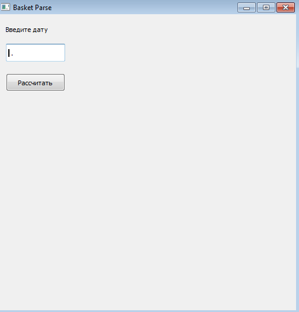
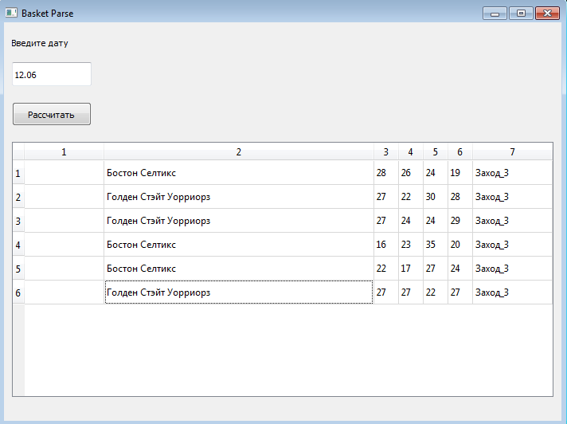
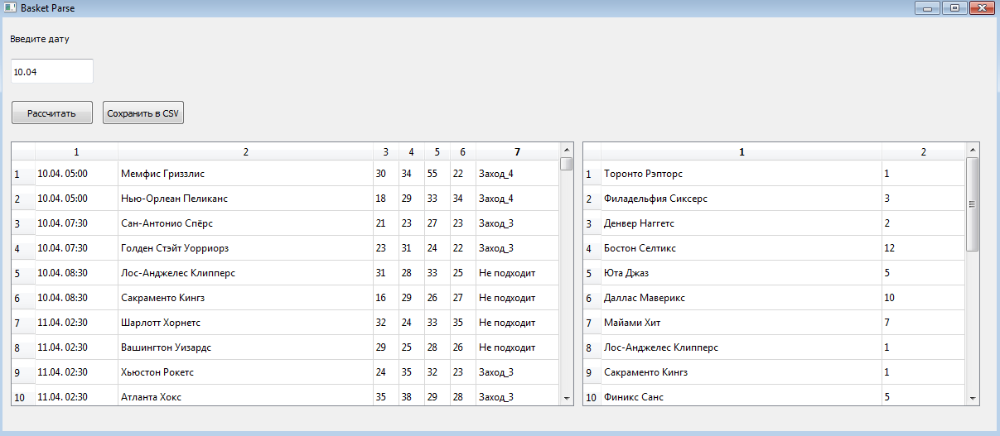

# basket_algo
Алгоритм, который проверяет схему "Победа аутсайдера в 3 четверти"
## 1.0 
-------------
- **basket.py** забирает данные, парсит и выдаёт результат в Excel
- Для работы нужны файлы **bask.html** и **teams.xlsx** 
## 1.1 
-------------
- Файл **countTeam.py** считает частоту отыгрыша команд и сортирует от самых популярных 
- Введён парсинг матче до определённой даты (дату указывать точно) 
## 1.2
-------------
- Файл **basket.py** разбит на несколько файлов для удобства поддержки
- Поиск по дате улучшен: если в нужный день матчей не было, проверяется предыдущий день и так пока не будут найдены игры 
## 1.2.1
-------------
- Небольшие правки кода
## 1.2.2
-------------
- Небольшие правки кода
## 1.2.3
-------------
- Небольшие правки кода. Разбиение на структуру data/display 
- data - каталог с файлами, обрабатывающими данные 
- display - каталог с файлами, отвечающими за отображение (вывод и прочее)
## 1.2.4
-------------
- Небольшие правки кода
## 2.0 / 2.0.1
-------------
- Подключен PyQT5 и создан первый графический интерфейс 

## 2.1
-------------
- Небольшие правки кода
- Переопределение некоторых функций 
## 2.1.1
-------------
- Небольшие правки кода
## 2.2
-------------
- Добавлен вывод Excel в интерфейс приложения

## 2.3
-------------
- Добавлен вывод даты в интерфейс приложения
## 2.4
-------------
- Добавлена возможность сохранять файл в .csv формате 
## 2.4.1
-------------
- Небольшие правки кода
## 2.4.2
-------------
- Программа теперь не сохраняет HTML в файл, а 'варит' soup напрямую из HTML. 
- Функция ParseInHTML переписана в класс, который получает url, варит и отдаёт soup
## 2.4.3
-------------
- Все функции "выдёргивания" элементов (очки, названия команд) - теперь методы класса Match
## 2.4.4
-------------
- Все функции сохранения и вывода элементов на экран - теперь методы класса MatchList
## 2.4.5
-------------
- Удалён файл с глобальными переменными из-за того, что теперь эти переменные - атрибуты классов Match/MatchList
## 2.4.6
-------------
- Весь парсинг и поиск "крайних" матчей теперь происходит в классе SoupFromHTML
## 3.0
-------------
- Изменён графический интерфейс - добавлена таблица, в которой отображется кол-во матчей, в которых команда "отыгралась" в 3 или 4 четверти 

## 3.1
-------------
- Selenium заменён на selenium-wire. Добавлено обновление сайта при неудачной загрузке  
