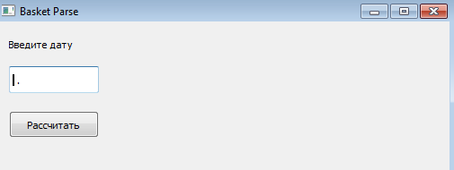

# basket_algo
Алгоритм, который проверяет схему "Победа аутсайдера в 3 четверти"
## 1.0 
-------------
- **basket.py** забирает данные, парсит и выдаёт результат в Excel
- Для работы нужны файлы **bask.html** и **teams.xlsx** 
## 1.1 
-------------
- Файл **countTeam.py** считает частоту отыгрыша команд и сортирует от самых популярных 
- Введён парсинг матче до определённой даты (дату указывать точно) 
## 1.2
-------------
- Файл **basket.py** разбит на несколько файлов для удобства поддержки
- Поиск по дате улучшен: если в нужный день матчей не было, проверяется предыдущий день и так пока не будут найдены игры 
## 1.21
-------------
- Небольшие правки кода
## 1.22
-------------
- Небольшие правки кода
## 1.23
-------------
- Небольшие правки кода. Разбиение на структуру data/display 
- data - каталог с файлами, обрабатывающими данные 
- display - каталог с файлами, отвечающими за отображение (вывод и прочее)
## 1.24
-------------
- Небольшие правки кода
## 2.0 / 2.01
-------------
- Подключен PyQT5 и создан первый графический интерфейс 

## 2.10
-------------
- Небольшие правки кода
- Переопределение некоторых функций 
## 2.11
-------------
- Небольшие правки кода
## 2.20
-------------
- Добавлен вывод Excel в интерфейс приложения

## 2.30
-------------
- Добавлен вывод даты в интерфейс приложения 

